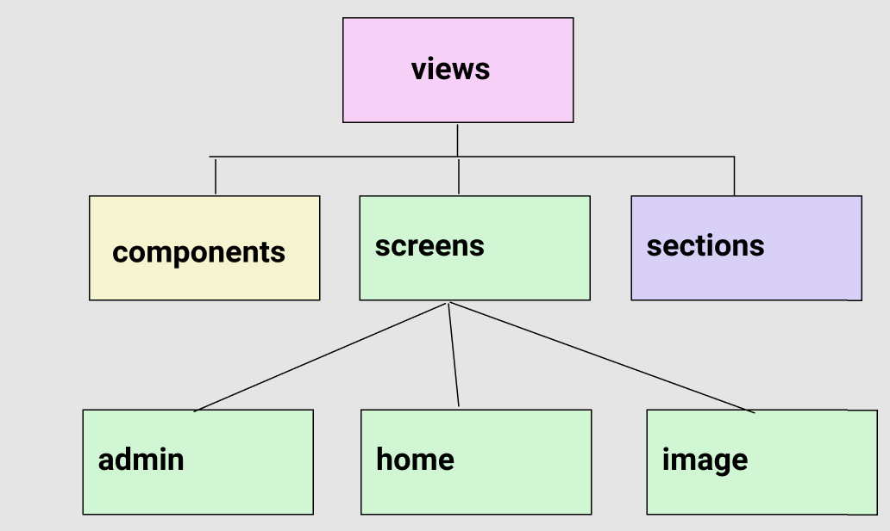
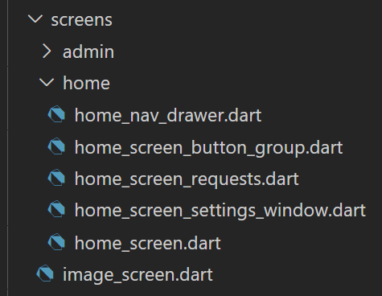
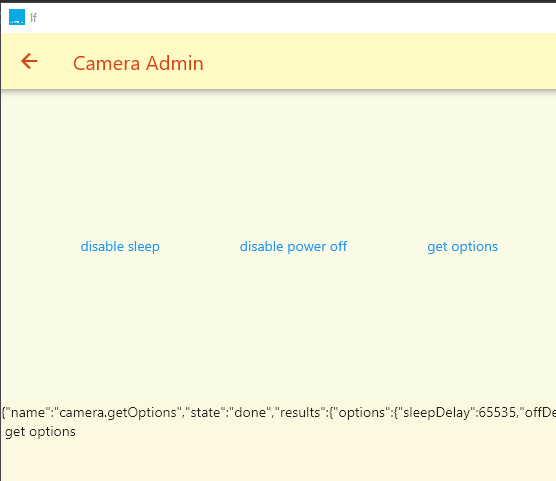

# RICOH THETA SC2 List Files Demonstration

This is a workaround for a bug in the RICOH THETA SC2
[listFiles API command](https://api.ricoh/docs/theta-web-api-v2.1/commands/camera.list_files/).

This demonstration will not work for the V or the Z1.  For those
models, you can get the thumbnail data directly from
the `camera.listFiles` API command if you specify the `maxThumbSize` as
`640`.

## List Files and Thumbnails


## Show 360 Image with Navigation on Separate Screen


## Video Tutorial Introduction

[RICOH THETA SC2 Developer Thumbnail Tutorial](https://youtu.be/QB7PiHJagFA)

## Test Environment

```json
  "model": "RICOH THETA SC2",
  "firmwareVersion": "01.64",
```

## Problem this Demo Addresses

Bug in SC2 API prevents thumbnail data from returning with
`camera.listFiles` if entryCount is more than one.

With maxThumbSize set to `0` (no thumb), `entryCount` functions
as expected.

```dart
Future<http.Response> listFiles() async {
  var url = 'http://192.168.1.1/osc/commands/execute';
  var data = {
    'name': 'camera.listFiles',
    'parameters': {
      'fileType': 'image',
      'entryCount': 10,
      'maxThumbSize': 0,
      '_detail': true,
    }
  };
```

Result shows array of 10 thumbs.

```json
      {
        "name": "R0012013.JPG",
        "fileUrl": "http://192.168.1.1/files/thetasc26c21a247d9055838792badc5/100RICOH/R0012013.JPG",
        "size": 4121231,
        "isProcessed": true,
        "previewUrl": "",
        "dateTimeZone": "2021:09:14 15:58:42-07:00",
        "width": 5376,
        "height": 2688,
        "_thumbSize": 9688
      }
    ],
    "totalEntries": 55
  },
  "state": "done"
}
```

Setting maxThumbSize to `640` will only return a single thumbnail,
not all 10 thumbnails inline. Only one entry is returned.

To get all the thumbnails, you must get each thumbnail individually
using the URL of the file.

```json
mlzj9mO8hQc4OfaneUuBwCaOdj9mhdqj0pcrjAqW7jUbC5HrS5B75qSgBpcgdD+VIYokA70eYAeDRYdw8wY65pC6kUWC4b1HSk8w0WHzhvHpz9KA/PbFFg5h3nAHkZ+hpPPU8bTj/e/wDrUuULgZR12H/vr/61JvOeF/M07BdH/9k="
      }
    ],
    "totalEntries": 1
  },
  "state": "done"
}
```

## Project Overview

Demonstration of using Flutter to communicate with the RICOH THETA 360 camera.
Flutter recently moved to 2.2 (after moving to 2.0 only a few months before)
and dart 2.13.  The demonstration code shows the use of the following technology
as a test to make sure the new packages still work with the RICOH THETA
and the most recent stable version of Flutter:

* Flutter 2.2
* Dart 2.13 with sound null-safety
* http: ^0.13.3 - network connection with camera
  * alternative dio not tested
* provider: ^5.0.0 - state management
  * alternatives: GetX, BLoC not tested
* panorama: ^0.4.1


## Project Goals

* provide example of scalable Flutter application architecture for RICOH THETA mobile apps
  * previous examples became too confusing as the number of commands increased
* show example of http request/response state management using provider
  * alternative state management approaches under consideration: BLoC and GetX
* produce sharable example of using thumbnails with the RICOH THETA SC2
  * there is a bug in the API that prevents it from listing all thumbs in listFiles
* improve separation of network and data processing code from the buttons in the gui
* test http package, which has some limitations for RICOH THETA development
  * digest authentication with the Flutter http package does not work with the THETA - not implemented in this app
  * motionJPEG livePreview withthe Flutter http package does not work with the V and Z1 - not implemented


## Planned Educational Assets to Help Developers

* usable code example for a gentle introduction  to RICOH THETA SC2 API - this GitHub repo
* technical how to for SC2 API - article on theta360.guide site
* high level architectural concepts on how to structure RICOH THETA apps
with Flutter - blog. concepts usable for any app with http connection.


## Design Considerations

Choose the simplest and most common approach that meets the goals. For example,
MVC is one of the oldest and most common architectural paradigms.  Provider is the
easist and most state management approaches.

---

## App Architecture

[Discussion on Reddit](https://www.reddit.com/r/FlutterDev/comments/nl1qb5/architecture_patterns_for_flutter_applications/)

### Reference Template for MVC+S Architecture

[organization example from gskinner](https://blog.gskinner.com/archives/2020/09/flutter-state-management-with-mvcs.html)


#### Controller

* application-level commands initiated from the button
* can be chained together from the button press

#### Services

* external API calls
* parse and return data
* services do not touch the model

### Classic MVC


### Architecture for thumbnail project

Based on MVC+S as explained in gskinner article. Deviated from example by
putting data structure for thumbnail in commands to make encapsulation
of commands easier in the future.


* model
  * ChangeNotifiers (provider)
* view
  * screens
  * sections (portion of screen)
  * components like buttons
* commands
  * build the data that is shown on the response window. send it to view.
  * individual commands that are triggered and populated from view
  * data structures used by commands
  * commands (utility functions) that are trigged by other commands
* services
  * fundamental http connection, error handling, common across multiple services such as get info, listFiles
    * manage http request and pass response to commands
  * service that combines multiple services into a single abstraction such as "get thumb bytes". Example: external service (such as http network) functionality through multiple http network requests, one request per thumbnail. 
  * Other examples of services not covered in this app
    * local storage (for example if on Windows desktop, the pictures folder)
    * firebase








## Reference

* [eBay Motors](https://medium.com/ebaytech/ebay-motors-state-management-bd85cfc602a2)
* [Design Patterns in Flutter- Part 1(MVC) by Yashwant Kumar](https://medium.com/flutterdevs/design-patterns-in-flutter-part-1-c32a3ddb00e2)
* [A Design Pattern for Flutter by Greg Perry](https://medium.com/follow-flutter/a-design-pattern-for-flutter-db6ccaea2413)
* [Flutter: State Management using an MVC+S Architecture by Shawn Blais, Sept 14, 2020](https://blog.gskinner.com/archives/2020/09/flutter-state-management-with-mvcs.html)

## Notes

### eBay Motors

* separate package for each major screen
* each package was independently testable
* packages allowed each team to work on a separate screen without
interfering with the other teams
* each package exposed a widget, which was the entire screen with defined dependencies to fulfill its purpose. Everything else is private.
* main criteria were 1) package boundaries; 2) 100% test coverage with 
the package's public API.
* started using BLoC. moved to stateful widgets
* after 2 years, 240,000 lines of code, 5,000 tests, 80 packages
* can swap out the state management due to the boundaries of each package
and the simple public API that only exposes the information needed for the
package to function.


## To Do

* implement test strategy