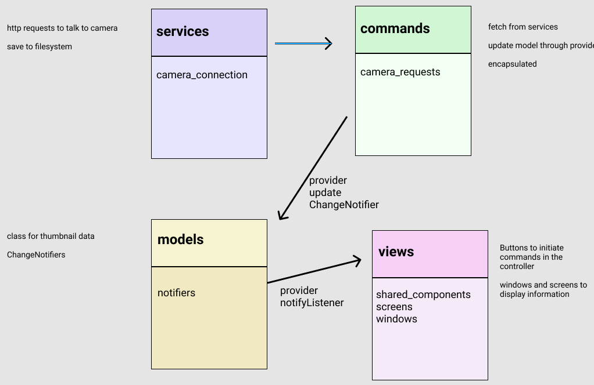

# THETA List Files Demonstration

## List Files and Thumbnails

## Show 360 Image with Navigation on Separate Screen

## Project Goals

* advance fundamental understanding of application architecture
* increase experience with state management using provider, though we may move to
another state management system in the future
* produce sharable example of using thumbnails with the RICOH THETA SC2
  * there is a bug in the API
* improve separation of network and data processing code from the buttons in the gui

## Project Expected Benefits

* usable code example to promote RICOH THETA SC2 API
* basis for content around SC2 API, likely post on Discourse
* basis for executive or manager-level high level overview content on architectural
concepts for third-party sites

---

## Architecture

[Discussion on Reddit](https://www.reddit.com/r/FlutterDev/comments/nl1qb5/architecture_patterns_for_flutter_applications/)

### Reference Template for MVC+S Architecture

[organization example from gskinner](https://blog.gskinner.com/archives/2020/09/flutter-state-management-with-mvcs.html)

#### Controller

* application-level commands initiated from the button
* can be chained together from the button press

#### Services

* external API calls
* parse and return data
* services do not touch the model

### Classic MVC

### Architecture for thumbnail project

Based on MVC+S as explained in gskinner article.

* model
  * ChangeNotifiers (provider)
* view
  * gui sections
    * screens and windows (portion of screen)
  * gui components like buttons
* controller
  * manage the http response. build the data that is shown on the response window. send it to view.
  * individual http API request templates that are triggered and populated from view
* services
  * local storage (for example if on Windows desktop, the pictures folder)
  * fundamental http connection, error handling
  * firebase

## Reference

* [Design Patterns in Flutter- Part 1(MVC) by Yashwant Kumar](https://medium.com/flutterdevs/design-patterns-in-flutter-part-1-c32a3ddb00e2)
* [A Design Pattern for Flutter by Greg Perry](https://medium.com/follow-flutter/a-design-pattern-for-flutter-db6ccaea2413)
* [Flutter: State Management using an MVC+S Architecture by Shawn Blais, Sept 14, 2020](https://blog.gskinner.com/archives/2020/09/flutter-state-management-with-mvcs.html)
