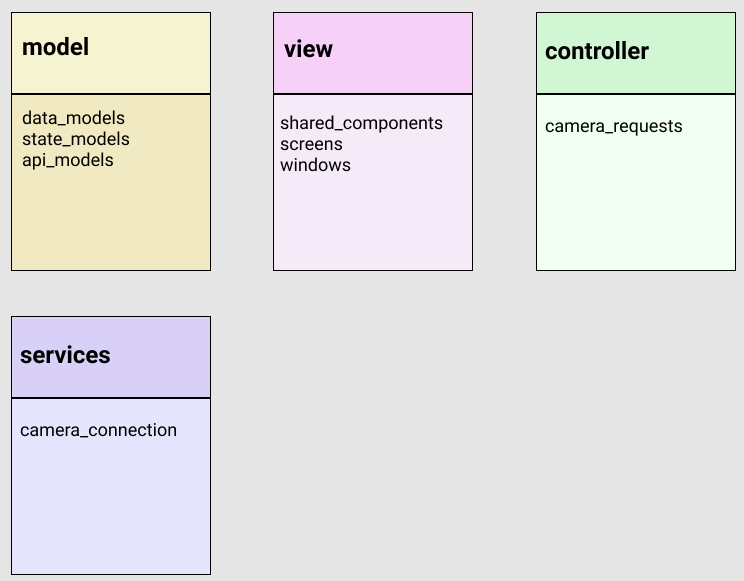

# THETA List Files Demonstration

## Project Goals

* advance fundamental understanding of application architecture
* increase experience with state management using provider, though we may move to
another state management system in the future
* sharable example of using thumbnails with the RICOH THETA SC2 as there is a bug
in the API
* improve separation of network and data processing code from the buttons in the gui

---

## Architecture

### Idea 1

### Idea 2

* model - it's sparse
* view
  * gui sections
    * screens and windows (portion of screen)
  * gui components like buttons
* controller
  * manage the http response. build the data that is shown on the response window. send it to view.
  * individual http API request templates that are triggered and populated from view. there are so many...
* services
  * local storage (for example if on Windows desktop, the pictures folder)
  * fundamental http connection, error handling
  * firebase
* state
  * ChangeNotifiers (I'm using provider)

## Reference

* [Design Patterns in Flutter- Part 1(MVC) by Yashwant Kumar](https://medium.com/flutterdevs/design-patterns-in-flutter-part-1-c32a3ddb00e2)
* [A Design Pattern for Flutter by Greg Perry](https://medium.com/follow-flutter/a-design-pattern-for-flutter-db6ccaea2413)

